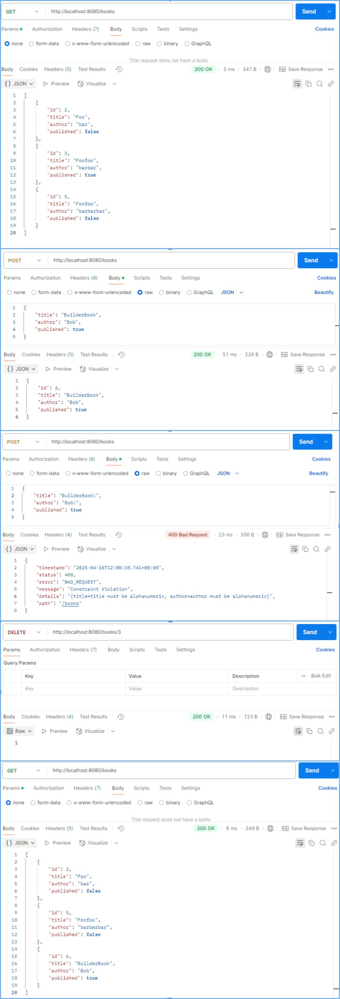

# spring-boot-books

This is a demo Spring Boot API project

## Quickstart

1. Install Java jdk-24 (https://www.oracle.com/hk/java/technologies/downloads/#java24)

2. Check Java version using `java --version` on terminal. Make sure environmment variable `JAVA_HOME` is pointed towards the jdk folder, e.g. `C:\Program Files\Java\jdk-24`.

3. cd to `/book` then run command 
```
./mvnw spring-boot:run
```

4. Default port is `8080`. From browser or using tools like Postman, check 
`localhost:8080/health` and you should see the `Healthy!` response. If you need to use another port, for example add `server.port=8081` to `application.properties` to set it to run on port 8081.

## APIs

### GET /Books

Gets a list of boks

#### Parameters
None
#### Responses
- 200
```
{
    id: number,
    title: string,
    author: string,
    published: boolean
}[]
```
### POST /Books
Submit a book
#### Parameters
application/json.
```
{
    title: string,
    author: string,
    published: boolean
}
```
#### Responses
- 200\. The created book
```
{
    id: number,
    title: string,
    author: string,
    published: boolean
}
```
- 400\. When the book input is invalid.
```
{
    "timestamp": string,
    "status": 400,
    "error": "BAD_REQUEST",
    "message": "Constraint Violation",
    "details": string,
    "path": string
}
```
- 415\. When request body is not type is not json.
```
{
    "timestamp": string,
    "status": 415,
    "error": "Unsupported Media Type",
    "message": string,
    "path": string
}
```
### DELETE /Book/{id}

Delete a book. 

#### Parameters
- id. Id of a book.
#### Responses
- 200\. Book deleted. Note that if the id does not exist, nothing will be deleted and 200 will still be returned.

## Dev Notes

- The DB is set to sqlite. The file is in `/data/test.db`.

- On testing mode, DB is set to h2 in-memory database.

## API Call Screenshot

Screenshot of example API calls using Postman.

